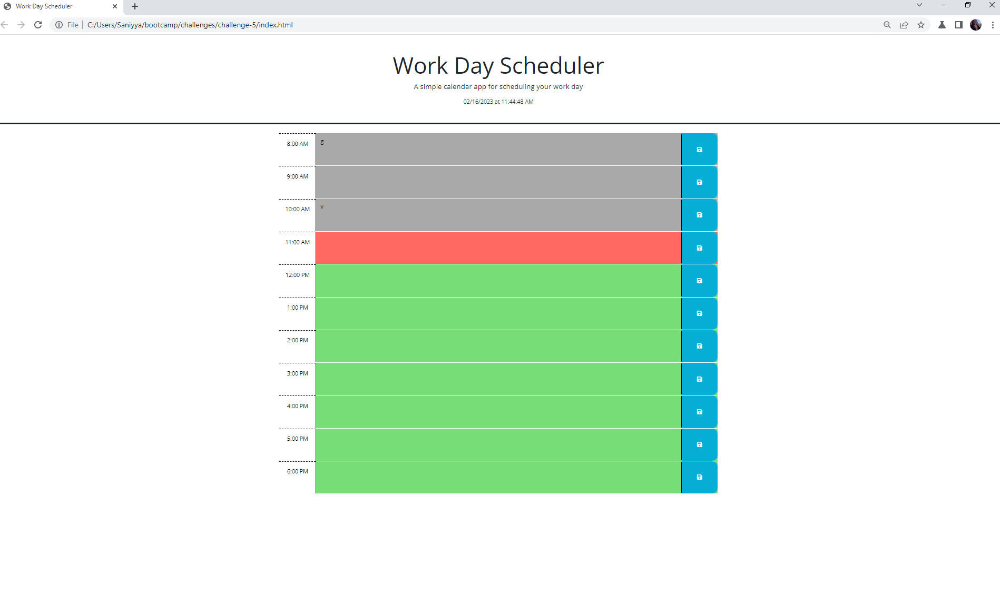

## To Do Calendar

This app functions as a weekly work calendar. The current date and time will be displayed on the top of the page. Each hour of your work day is seperated into different rows. The current working hour will display red, past hours will be gray, and future hours green.

## User Story

```md
AS AN employee with a busy schedule
I WANT to add important events to a daily planner
SO THAT I can manage my time effectively
```
## Deployed link 
https://sanmcc.github.io/Work-Day-Schedule/ 

## Screenshot
